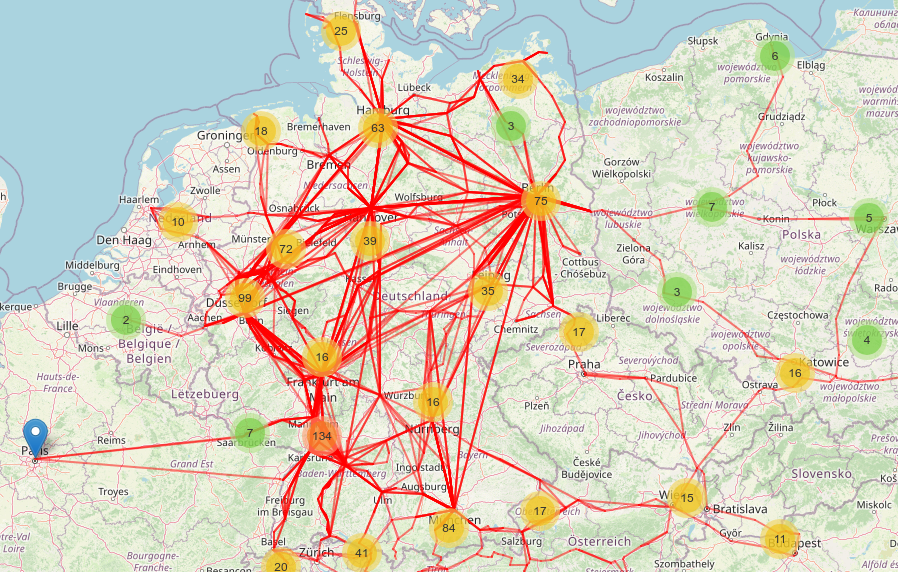

## Bellman-Ford implementation based on the GTFS format

This project is a simple implementation of the Bellman-Ford algorithm to find the shortest path between two stops in a GTFS dataset.
### Installation
To install all the python packages, you can run the following command:
```bash
pip install -r requirements.txt
```
### Dataset
The dataset used in this project is the "Long Distance Rail Germany" GTFS dataset from the [Germany GTFS Feed](https://gtfs.de/en/feeds/) website. You can also use any other GTFS dataset you like. \
If you want to use another dataset, put the content in a new directory under the `gtfs` directory and change the `gtfs_dataset` variable in the `notebooks/config.py` file to the corresponding directory name.
### Usage
To run the project, first run the `notebooks/preprocessing.ipynb` notebook to preprocess the GTFS dataset. This should create a new `.csv` file inside the `data` directory with the same filename as the directory name from the dataset. \
Then, you can run the `notebooks/find_route.ipynb` notebook to find the shortest path between two stops at a specific time which can be changed freely. \
Additionally, you can run the `notebooks/visualize_all_nodes.ipynb` notebook to visualize all the nodes and edges of the dataset.